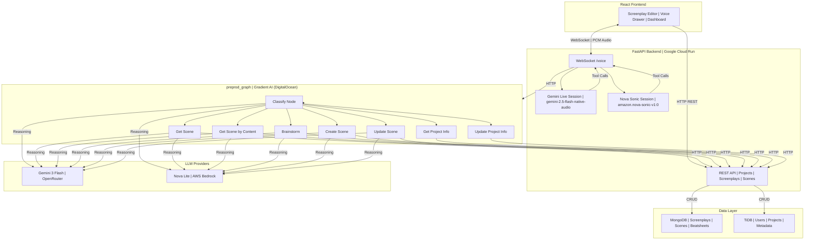
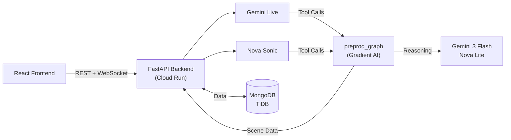

# APS - Full Project Architecture

```mermaid
flowchart TD
    subgraph Frontend ["React Frontend"]
        UI["Screenplay Editor | Voice Drawer | Dashboard"]
    end

    subgraph Backend ["FastAPI Backend | Google Cloud Run"]
        API["REST API | Projects | Screenplays | Scenes"]
        WS["WebSocket /voice"]
        GLS["Gemini Live Session | gemini-2.5-flash-native-audio"]
        NSS["Nova Sonic Session | amazon.nova-sonic-v1:0"]
    end

    subgraph Graph ["preprod_graph | Gradient AI (DigitalOcean)"]
        CL["Classify Node"]
        GS["Get Scene"]
        GSC["Get Scene by Content"]
        BS["Brainstorm"]
        GPI["Get Project Info"]
        CS["Create Scene"]
        UPI["Update Project Info"]
        US["Update Scene"]
    end

    subgraph LLMs ["LLM Providers"]
        GF["Gemini 3 Flash | OpenRouter"]
        NL["Nova Lite | AWS Bedrock"]
    end

    subgraph Data ["Data Layer"]
        MDB["MongoDB | Screenplays | Scenes | Beatsheets"]
        TIDB["TiDB | Users | Projects | Metadata"]
    end

    UI -->|"HTTP REST"| API
    UI <-->|"WebSocket | PCM Audio"| WS
    WS --> GLS
    WS --> NSS
    GLS -->|"Tool Calls"| WS
    NSS -->|"Tool Calls"| WS
    WS -->|"HTTP"| Graph
    API -->|"CRUD"| MDB
    API -->|"CRUD"| TIDB
    Graph --> CL
    CL --> GS & GSC & BS & GPI & CS & UPI & US
    GS & GSC & BS & CS & US -->|"HTTP"| API
    GPI & UPI -->|"HTTP"| API
    CL -->|"Reasoning"| GF
    CL -->|"Reasoning"| NL
    GS & GSC & BS & CS & US -->|"Reasoning"| GF
    GS & GSC & BS & CS & US -->|"Reasoning"| NL
```

## Simplified Version

```mermaid
flowchart LR
    A["React Frontend"]
    B["FastAPI Backend\n(Cloud Run)"]
    C["Gemini Live"]
    D["Nova Sonic"]
    E["preprod_graph\n(Gradient AI)"]
    F["Gemini 3 Flash\nNova Lite"]
    G[("MongoDB\nTiDB")]

    A -- "REST + WebSocket" --> B
    B --> C
    B --> D
    C -- "Tool Calls" --> E
    D -- "Tool Calls" --> E
    E -- "Reasoning" --> F
    E -- "Scene Data" --> B
    B <-- "Data" --> G
```
